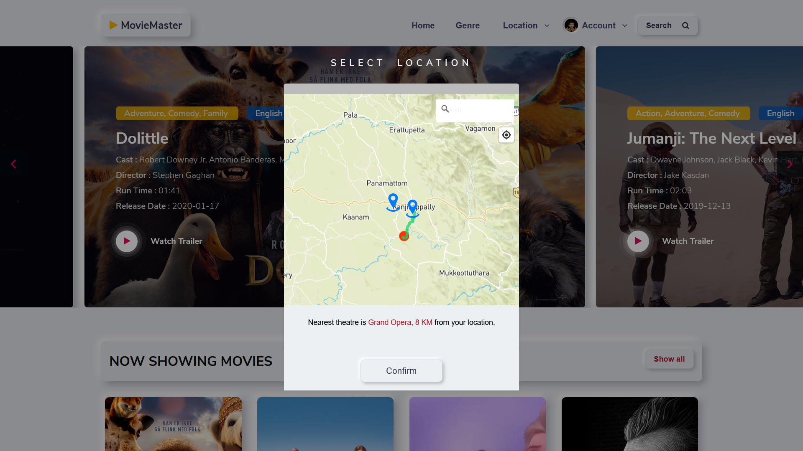
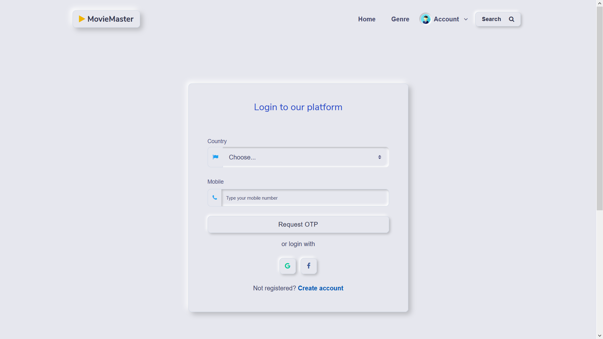
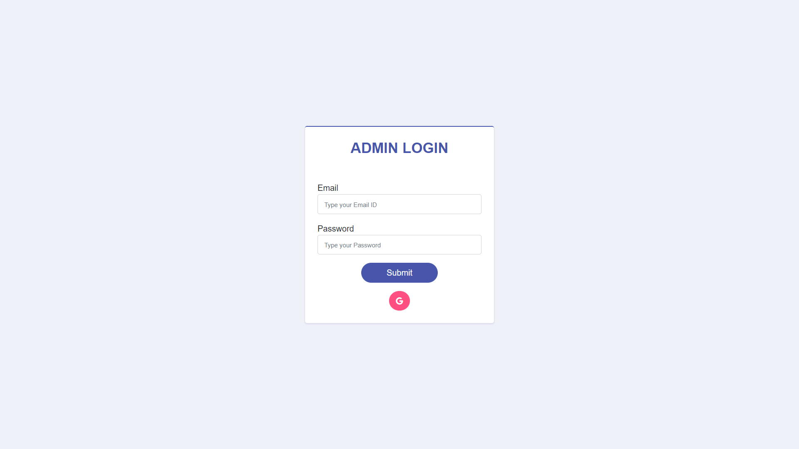
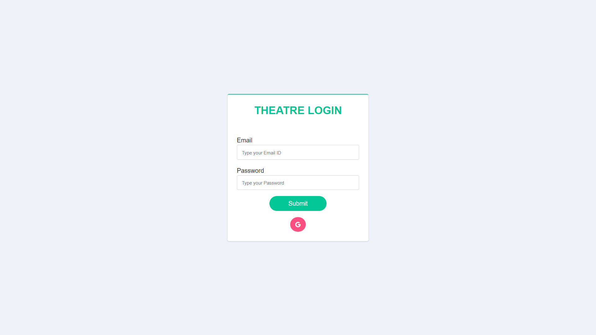

# **MovieMaster** | *Enjoy the show*


## **ABSTRACT**

This website site is very useful for users who want to order tickets of their favourite shows in the nearest theatre. users can pick the theatre then users can check the number of shows in the theatre and also users can watch the trailer of the movie. Users must be logged in for booking the shows. two payment API integrated into this project which is PayPal and Razorpay. Users can view the booking details.

## **FEATURES**

### **1. Users**

* Users must choose or pick the nearest theatre for a new booking.
* Users can create an account or login the existing account to view old booking details and also users can book for new shows.
* Users can watch the movie trailers and also be able to check the movie still showing in the theatre.
* Users can choose the number of seats based on the prices ( VIP, premium, Executive, normal )
* Users can choose any movie listed in the Categories of movies





### **2. Admin**

* Admin can log in into the admin panel by using the predefined username and password.
* Admin can view the number of users and the details of the users.
* Admin can view the Owner and their details also.
* Admin can view the revenue/profit from the theatre owners.




### **3. Theatre Owners**

* Theatre owners can log in into the Theatre main page by using username and password given by the admin.
* Theatre owners can view the number of shows in the list and the upcoming movies.
* Theatre owners can view the seat availability and the number of shows in a screen.
* The owner can view the number of ticket purchases made by Users.




## **MODULES**

### **1. Landing page**

* User will see the landing page first while he opens the app 
* In this page, the user must choose a location to find the nearest theatres.
* List of Movies
* View Trailer From the Landing page.
* Users can select the Categories of movies.


### **2. Login/Signup page**

* **User**:
Users need to Login to the page or Signup for booking the shows.
* **Admin**:
Admin can log in into the admin panel as superuser.
* **Theatre**:
Theatre users can log in into the theatre main page as owner.

### **3. Booking function**

* Users can only book for the show if the user is selected for the seats and also the user must be logged in.
* Paypal and Razorpay Two payment Gateway is available for the users for seat booking.

### **4. Add theatre owner function**
 * Admin can Add the theatre owner and his details.
### **5. Delete theatre owner function**
* Admin can only delete the owners.
### **6. Edit theatre owner function**
* Edit the Theatre owner details.
### **8. Add movie function**
* Theatre owner can add the Movie details and the time of the show.
### **9. Edit movie function**
* Owners can edit the details of the movie and the time of the show.
### **10. Delete movie function**
* Delete the Movie details.
### **11. Add Screen function**
* Owners can add the details of the screen and the number of seats. ( VIP, premium, Executive, normal )
### **12. Edit Screen function**
* Change the details of the screen and seat arrangement.

### **Prerequisite**

You need to have [NodeJS](https://nodejs.org/en/) and [MongoDB](https://www.mongodb.com/) installed in your machine.

### **Install**

* Clone the repository.
* Go to the repository folder and run the following command in your terminal:

```
npm install
```

#### **Usage**

Now you can just run the following in terminal:

```
npm run dev
```

You can see the following in terminal

```
[nodemon] 2.0.6
[nodemon] to restart at any time, enter `rs`
[nodemon] watching path(s): *.*
[nodemon] watching extensions: js,mjs,json
[nodemon] starting `node ./bin/www`
Server up on PORT: 3000
Database Connected to PORT: 27017
```

### **Open in Browser**


```
Go to http://localhost:3000
```

MovieMaster is licensed under the [MIT license](http://opensource.org/licenses/MIT)

```
                                                 © 2021 VISHNU C PRASAD
```

